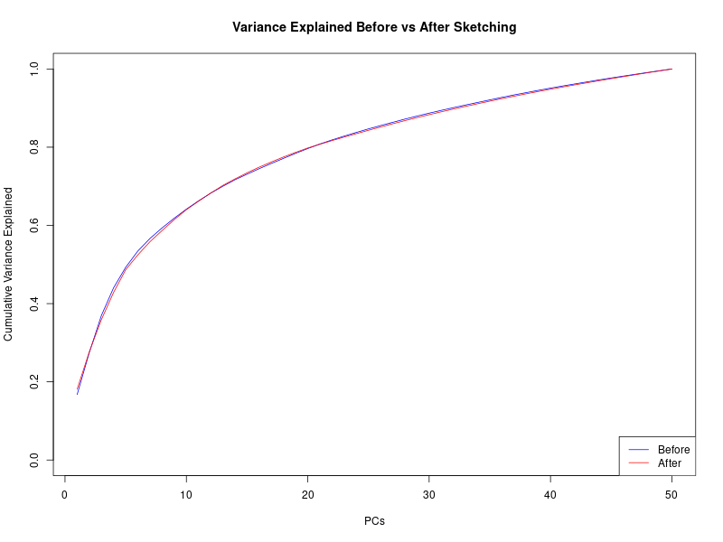
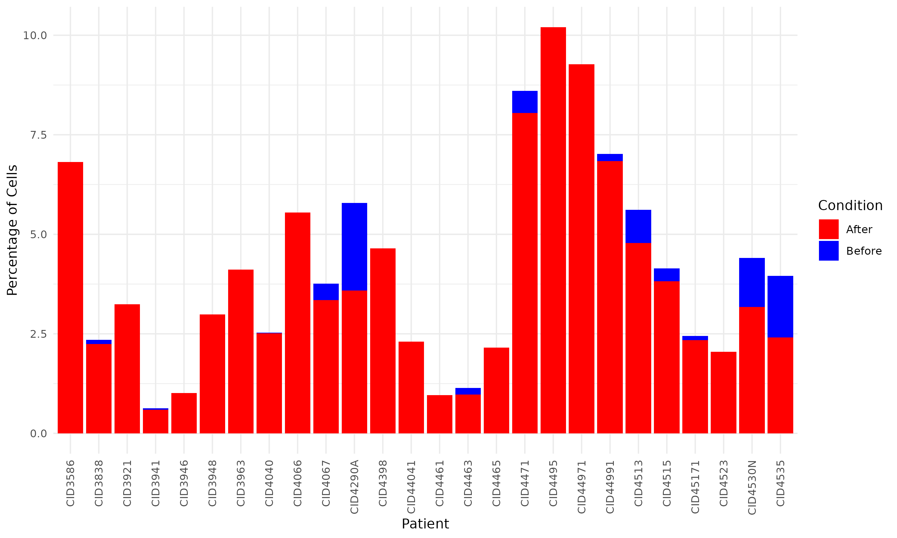

# 📊 Sketching a Seurat Object Using Leverage Score Sampling

To make gene module discovery faster, we apply a method known as **data sketching**, which involves selecting a small, representative subset of the data to speed up downstream analysis.

There are two primary approaches to sketching:

- **Leverage Score Sampling**: This method uses the statistical leverage scores derived from the data's principal components to identify cells that contribute most to the variance of the dataset. These high-leverage cells are then sampled more frequently, allowing the sketch to retain key biological signals and structure.

- **Randomized Sampling**: In this approach, cells are selected randomly without regard to variance or information content. While simpler, this method may miss rare cell types or subtle biological variation.

In our case, because we aim to **preserve biological variance** as much as possible in getting the gene modules, we will use **Leverage Score Sampling**.

> ⚠️ Note: Sketching is not intended to yield strong biological conclusions, since only a small fraction of the population is analyzed. It is primarily used for **exploratory analysis**, **code testing**, **pipeline debugging**, and **educational purposes**.

This script performs sketching (downsampling) of a Seurat object using **Leverage Score Sampling**, followed by **PCA** and **UMAP** analysis with visualization. It helps reduce the number of cells while retaining essential biological features and structure.

---

## 📁 File Structure

- `sketch.R` – The main R script to perform sketching and generate visualizations.
- `figures/` – Output directory that will store the generated plots.
- `README.md` – This documentation file.

---

## 🚀 How to Use

### 1. Prerequisites

Install the required R packages:

```r
install.packages(c("ggplot2", "dplyr"))
# For Seurat:
if (!requireNamespace("Seurat", quietly = TRUE)) {
  install.packages("Seurat")
}
```
## 📊 Sketching Evaluation

###  Cumulative Variance Explained



The **cumulative variance explained plot** shows that the sketched dataset closely follows the full dataset across principal components.  
This indicates that **Leverage Score Sampling successfully preserved the global variance structure** of the original dataset, making it suitable for exploratory analyses and method prototyping.

---

###  Cell Proportion Comparison in each patient



This plot shows the **cell proportion** before and after sketching.  
It indicates that **the proportions were not significantly altered**, suggesting that the sketching process retained each patient's cell proportion.
